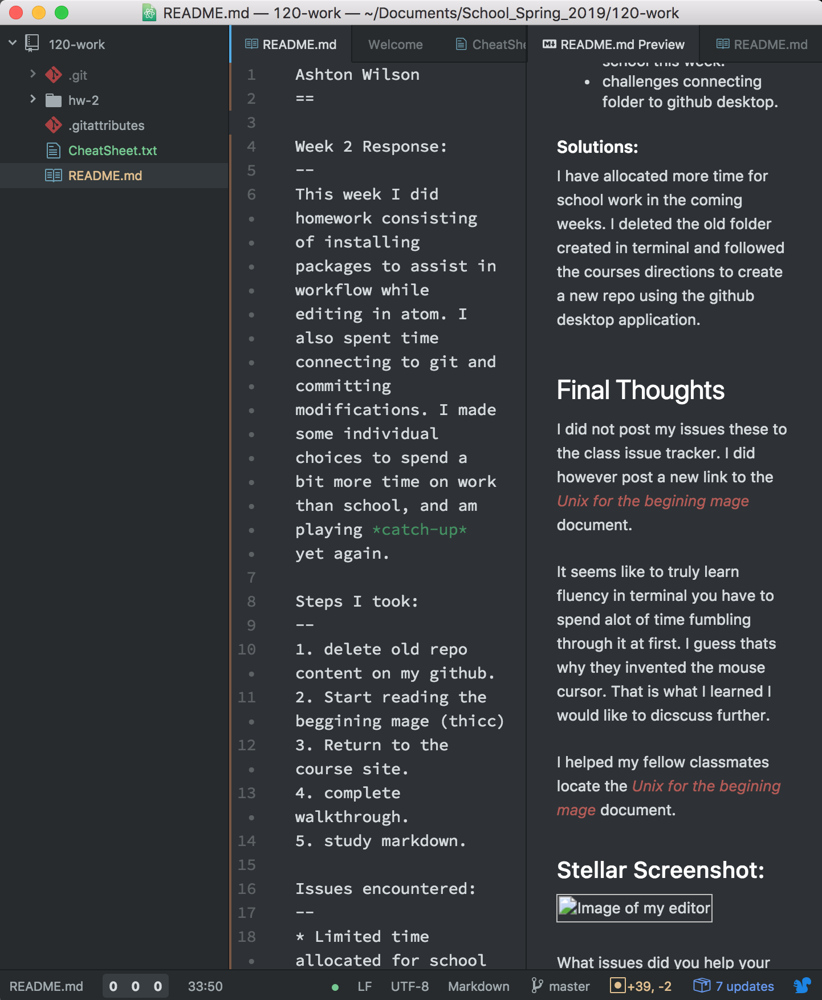

Ashton Wilson
==

Week 2 Response:
--
This week I did homework consisting of installing packages to assist in workflow while editing in atom. I also spent time connecting to git and committing modifications. I made some individual choices to spend a bit more time on work than school, and am playing *catch-up* yet again.

Steps I took:
--
1. delete old repo  content on my github.
2. Start reading the beginning mage (thicc)
3. Return to the course site.
4. complete walkthrough.
5. study markdown.

Issues encountered:
--
* Limited time allocated for school this week.
* challenges connecting folder to github desktop.

##### Solutions:
I have allocated more time for school work in the coming weeks. I deleted the old folder created in terminal and followed the courses directions to create a new repo using the github desktop application.

Final Thoughts
--
I did not post my issues this week to the class issue tracker. I did however post a new link to the [_Unix for the beginning mage_](http://lab46.corning-cc.edu/_media/haas/ufbm.pdf) document.

It seems like to truly learn fluency in terminal you have to spend a lot of time fumbling through it at first. I guess that's why they invented the mouse cursor. That is what I learned that I would like to discuss further.

I helped my fellow classmates locate the [_Unix for the beginning mage_](http://lab46.corning-cc.edu/_media/haas/ufbm.pdf)  document.

### Stellar Screenshot:

  Here's some inline
  code in action.
